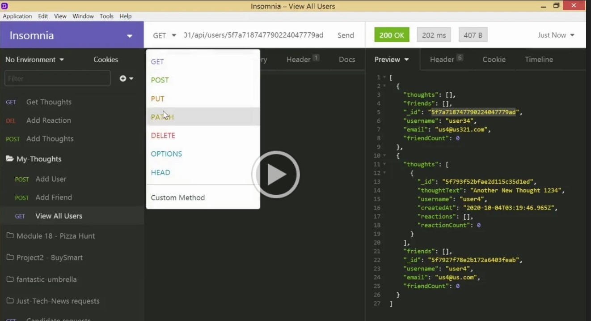

# My Thoughts API

## Description
The My Thoughts social media api utlizes MongoDB and Mongoose.js to create a platform where users can share their thoughts, and react to each others' thoughts.

  
## Table of Contents
* [Installation](#installation)
* [Usage](#usage)
* [License](#license)
* [Questions](#questions)
 
## Installation
Clone the repository and run NPM install.

## Usage
Initiate the application by running 'npm start'. The API contains GET routes to pull all users and all thoughts, as well as individual users and thoughts based on ID. PUT routes update user and thought information, as well as the ability to add friends and reactions. DELETE routes remove friends from a user's friend list, remove reactions from a user's thoughts, and removes users and thoughts directly. 

### DEMONSTRATION VIDEOS

## License
This project is licensed under a ISC License license. 

## Questions
Have additional questions? Contact [cjacktwil](http://github.com.cjacktwil) or email traceyjackson112@gmail.com.
